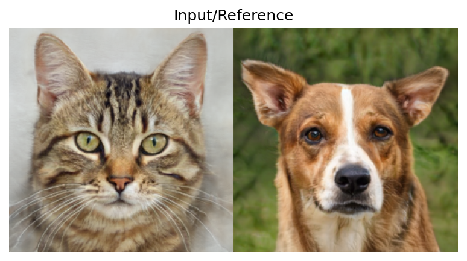
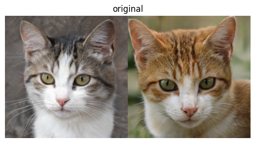

# Computer Vision project - Image morphing

This is the Github repository for my Image morphing in the subject of Digital Image processing and Computer Vision in Ho Chi Minh University of Technology.

## Table of Content
1. [Image Demos](#image-demos)
2. [Code](#code)
3. [Dataset](#dataset)

## Image Demos

### Cross dissolving

| Input 1  | Input 2 | Alpha=0.4 | Alpha=0.5 |
| ------------- | ------------- | ------------- | ------------- |
|   |   |   |  | 

### Triangle mesh warping

### GAN morphing

Morphing of 2 images
| Input | Output |
| ------------- | ------------- |
|  |  |
|  |  |

Blending with GAN
| Input | Ox blend | Oy blend |
| ------------- | ------------- | ------------- |
|   |   |   | 

Swapping with GAN
| Input | Ox blend |
| ------------- | ------------- |
|   |   | 
## Code

### Inference

The code for each morphing method is placed inside its named folder. It is easier to upload the Jupyter Notebook to Google Colab and run it.

### Training

The `Cross dissolving` and `Triangle mesh warping` are performed without training any neural networks.

For `GAN morphing`, please refer to the training strategy in [SOAT](https://github.com/mchong6/SOAT.git) for the StyleGAN model.

## Dataset

Please refer to these repositories of [FFHQ](https://github.com/NVlabs/ffhq-dataset) and [AFHQ](https://github.com/clovaai/stargan-v2) to download the datasets.

**Acknowedgement**: My work for GAN morphing is built upon [SOAT](https://github.com/mchong6/SOAT.git).